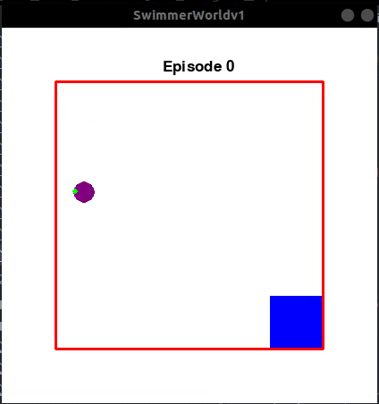

# LearningToSwim-DQN
Training an RL agent to swim at low Reynolds Number with DeepQLearning and experience replay. Microswimmers are tiny(um-scale) particles that are a simple model to study motion at the microscopic level. In low Reynolds numbers environments the drag forces and brownian motion dominate. Microorganisms like bacteria and fungi have evolved to overcome such hurdles and in many cases use them to their advantage to propel and move around.The microwsimmer (here) is propelled by a laser focused on its edge giving it an average velocity in particular directions relative to the laser point. The goal is to reach the target (blue square) in as few steps as possible.

The environment is written in Pygame and many physical parameters like the diffusion coefficient can be found in the class Swimmer. The observation space is continous and has x, y and the distance from the target as its coordinates. The action space has four elements Up,Left,Right,and Down. The agent recieves a reward when it gets closer to the target and a bigger reward when it actually reaches the target. Each episode starts with the swimmer at a random position and ends when it reaches the target/goes out of bounds. Respectable performance is achieved in 400 episodes, where it consecutively reaches the target more than 20 times. 

Neural Network Architecture:

One hidden layer with 100 nodes and a nonLinear activation function. (Not deep really)

Written in pyTorch.

Update 19/05 :

The state space has been reduced to two dimensions, the success rate (in the last 50 episodes) hits the 100% mark around 320-350 episodes.
Added Tensorboard functionality to monitor ongoing training stats.
